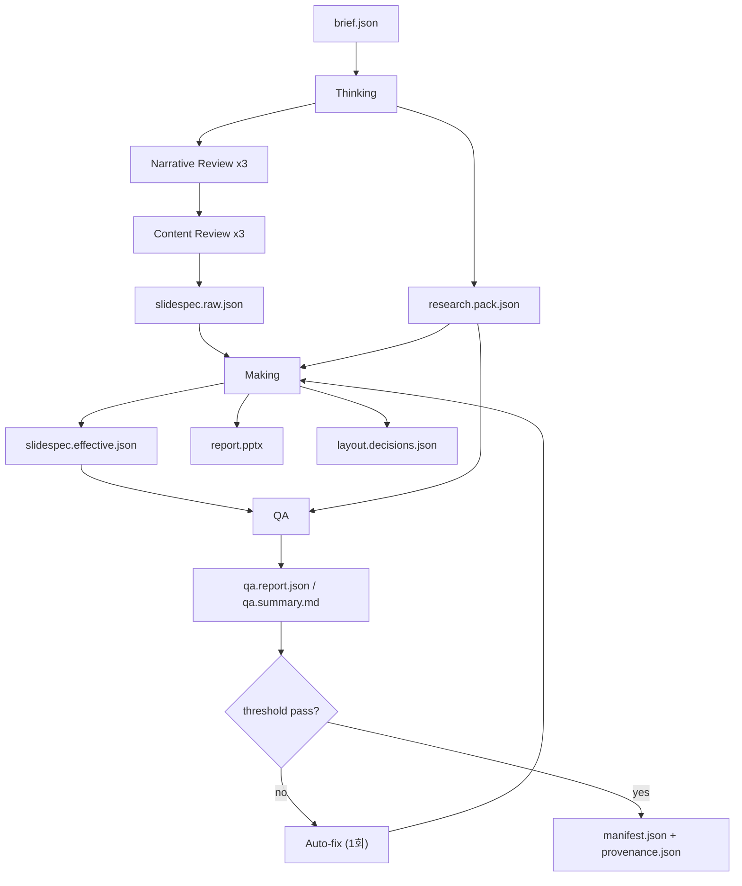

# Architecture

이 문서는 이 저장소의 목적, 구조, 동작 원리를 코드 기준으로 정리한 단일 참조 문서입니다.
새로운 기여자는 이 파일만 읽어도 파이프라인의 입출력, 내부 단계, 실패 처리, 확장 포인트를 이해할 수 있습니다.

## 1) 목적

이 프로젝트는 전략 컨설팅 보고서 스타일의 PPT를 자동 생성합니다.

핵심 목표:
- 스토리라인 일관성: cover → 분석 → 리스크 → 실행 → 부록
- 근거 추적성: `claim -> evidence_ids -> sources`
- 실행 안정성: 점수 기반 QA 게이트와 자동 보정
- 재현성: deterministic mode로 동일 입력/seed에서 동일 결과

비목표:
- 완전한 디자인 툴 대체
- 모든 산업의 도메인 지식 자동 완성

## 2) 시스템 구성

모노레포 구조:
- `apps/cli`: 사용자 실행 진입점(`run`, `think`, `make`, `qa`, `feedback`)
- `apps/worker`: 비동기 잡 실행 진입점
- `packages/shared`: 공통 타입/에러/로깅/시간/해시
- `packages/thinking`: 브리프 정규화, 리서치 팩, 스토리/슬라이드 스펙 생성
- `packages/making`: 레이아웃 결정 + PPT 렌더링
- `packages/qa`: 점수 계산 및 이슈 판정
- `packages/memory`: 실행 아티팩트/피드백 저장, 학습 규칙 로드

## 3) 전체 파이프라인

핵심 특징:
- **research-first**: 본문은 리서치 팩(evidence/source) 기반으로 생성
- **multi-pass thinking**: 스토리라인 3회 + 페이지 콘텐츠 3회 반복 검토
- **layout-guided refinement**: 초기 본문 생성 후 레이아웃을 결정하고, 선택 레이아웃 기준으로 본문을 재구성
- **multi-round pre-render review**: 텍스트 수용량/스토리/중복/아이콘 의미 균형을 기본 4회 검증·보정
- **effective spec 기반 단일화**: 렌더링/QA/프로비넌스/매니페스트가 동일 스펙을 사용

## 4) Stage A: Thinking

진입:
- `apps/cli/src/commands/run.ts`
- `apps/cli/src/commands/think.ts`
- `packages/thinking/src/index.ts`

세부 단계:
1. `brief` 정규화
  - 파일: `packages/thinking/src/brief-normalizer.ts`
  - 기본값, 제약(max chars, min evidence 등) 적용
2. 학습 규칙 적용
  - 파일: `packages/memory/src/learning-rules.ts`
  - 과거 피드백 기반 정책을 brief에 반영
3. 리서치 팩 생성 또는 외부 주입
  - 파일: `packages/thinking/src/research-orchestrator.ts`
  - 파일: `packages/thinking/src/web-research.ts`
  - 브리프별로 검색 쿼리를 동적으로 생성(환경에 따라 LLM planner 또는 heuristic)하고, 검색 결과/Wikidata 기반으로 기관·공식 사이트를 매 실행마다 재발굴
  - 발굴된 출처를 실제 웹 조회 최소 30회 수행하고, **신뢰도(trust)+주제 연관성(relevance)** 동시 평가
  - 웹 리서치는 기본 3라운드로 반복되며, 라운드마다 약한 축을 우선 재탐색
  - `web.research.report.json`/`web.research.attempts.json`으로 시도/성공/축별 커버리지를 기록
  - 또는 `--research`로 외부 `research.pack.json` 사용
  - 외부 리서치 + 웹 리서치 + 내부 생성 리서치를 병합해 축별 최소 깊이(소스/근거/테이블)를 보강
4. 내러티브 플랜 생성
  - 파일: `packages/thinking/src/narrative-planner.ts`
  - 리서치 우선축(coverage/volatility/keyword signal) 기반으로 slide focus/title 동적 조정
5. 내러티브 반복 검토(최소 3회)
  - 파일: `packages/thinking/src/index.ts`
  - 제목 중복/섹션 역행/focus 반복을 점검하고 라운드별 보정
6. 슬라이드 스펙 생성
  - 파일: `packages/thinking/src/spec-builder.ts`
  - claim 구조: 진단/해석/실행
  - evidence pair 선택으로 수치 claim 안정성 강화
7. 콘텐츠 반복 검토(최소 3회)
  - 파일: `packages/thinking/src/index.ts`
  - 거버닝/claim 중복, 전후 슬라이드 연결성, So What 정합을 반복 보정
8. self-critic 후처리
  - 파일: `packages/thinking/src/self-critic.ts`
  - 길이/So What/evidence 최소 요건 보정
9. 스키마 검증
  - 파일: `packages/thinking/src/validator.ts`

산출:
- `input/brief.normalized.json`
- `research/research.pack.json`
- `research/web.research.report.json`
- `research/web.research.attempts.json`
- `spec/thinking.review.json`
- `spec/slidespec.raw.json` (run 시)

## 5) Stage B: Making

진입:
- `packages/making/src/renderer/pptxgen/index.ts`

세부 단계:
1. `slidespec`/table 참조 기본 검증(`sanitizeSpec`)
2. 슬라이드별 레이아웃 계획(`planLayoutForSlide`)
  - 파일: `packages/making/src/renderer/pptxgen/layout-planner.ts`
  - provider: `agentic`(기본) | `heuristic` | `openai` | `anthropic`
  - API 실패/키 누락 시 agentic-local fallback
3. **레이아웃 검증 패스**(`prepareSpecWithLayoutValidation`)
  - 파일: `packages/making/src/renderer/pptxgen/layout-validator.ts`
  - 후보 템플릿에 대해 content-fit score 계산
  - 필요 시 템플릿 스위칭
  - 텍스트 수용량 기반 보정(title/gm/claims)
4. 텍스트 피팅 엔진
  - 파일: `packages/making/src/renderer/pptxgen/text-fit.ts`
  - 문장 경계 우선 축약
  - 숫자 소수점 보존
  - `So What:` 구간 보존 로직
5. PPT 렌더링(PptxGenJS)
  - 파일: `packages/making/src/renderer/pptxgen/slide-types/consulting13.ts`
  - visual kind 기반 렌더(하드코딩 slide-id 중심 아님)
  - 의미 기반 아이콘 매핑
    - 파일: `packages/making/src/renderer/pptxgen/icon-library.ts`
  - 아이콘 렌더 파이프라인: `react-icons` -> `ReactDOMServer.renderToStaticMarkup()` -> `sharp` -> PNG(base64) 재사용
6. 디자인 토큰 적용
  - 파일: `packages/making/src/renderer/pptxgen/theme.ts`
  - 폰트는 Calibri 강제
7. 산출물 기록
  - `output/report.pptx`
  - `output/layout.decisions.json`
  - `output/provenance.json`
  - 반환값에 `effectiveSpec` 포함

## 6) Stage C: QA

진입:
- `packages/qa/src/index.ts`

점검 축:
- text QA: 메시지 형식/길이/중복/So What
  - `packages/qa/src/text-qa.ts`
- layout QA: 스토리 아크/필수 visual/과밀 리스크
  - `packages/qa/src/layout-qa.ts`
- data QA: 수치 claim과 evidence 정합
  - `packages/qa/src/data-qa.ts`
- source QA: source footer 및 출처 완전성
  - `packages/qa/src/source-qa.ts`

합산:
- `structure_consistency` 20
- `data_accuracy` 30
- `message_clarity` 20
- `visual_readability` 20
- `source_completeness` 10
- 총점 100

## 7) Auto-fix 루프 (run 커맨드 전용)

파일:
- `apps/cli/src/commands/run.ts`

동작:
1. effective spec로 QA 수행
2. threshold 미달 시 fixable rule에 한해 1회 자동 보정
3. 재렌더 → 재QA
4. 여전히 미달이면 오류 종료

자동 보정 예:
- claim/gm 길이 단축
- So What 보강
- evidence 보강(최소 2개)
- source footer 재구성

## 8) 데이터 계약(JSON Schema)

스키마 위치:
- `packages/thinking/schemas`

핵심 스키마:
- `brief.schema.json`
- `research-pack.schema.json`
- `slidespec.schema.json`
- `manifest.schema.json`
- `feedback.schema.json`

규칙:
- Stage 경계마다 schema validation 필수
- schema 불일치 시 즉시 예외(파이프라인 중단)

## 9) 실행 아티팩트 구조

런 루트:
- `runs/YYYY-MM-DD/<project_id>/<run_id>/`

주요 파일:
- `input/brief.raw.json`
- `input/brief.normalized.json`
- `input/learning.rules.json`
- `research/research.pack.json`
- `spec/slidespec.raw.json`
- `spec/thinking.review.json`
- `spec/slidespec.effective.json`
- `spec/slidespec.json` (현재 기준 유효 스펙)
- `output/report.pptx`
- `output/layout.decisions.json`
- `output/provenance.json`
- `qa/qa.report.json`
- `qa/qa.summary.md`
- `qa/autofix.json`
- `manifest.json`

## 10) Deterministic 모드

핵심:
- 옵션: `--deterministic --seed <value>`
- 동일 input hash + seed + 코드 버전에서 동일 run id/결과 지향

구현:
- `packages/shared/src/time.ts`
- `packages/shared/src/hash.ts`
- `apps/cli/src/commands/run.ts`

## 11) 실패 처리 원칙

LLM 레이아웃 실패:
- openai/anthropic 호출 실패 시 warning 로그 후 agentic-local fallback
- 파이프라인은 계속 진행

QA 실패:
- run 커맨드: auto-fix 1회 후 재시도
- qa 커맨드: threshold 미달 시 exit 1

웹 리서치 품질 실패:
- run/think 커맨드에서 relevance 성공 수가 기준 미달이거나 축 커버리지가 부족하면 즉시 실패

데이터 참조 실패:
- table visual의 `data_ref` 불일치 시 즉시 예외

## 12) 확장 포인트

추가하기 쉬운 지점:
- 새 visual kind
  - `packages/shared/src/types.ts`
  - `packages/making/src/renderer/pptxgen/slide-types/consulting13.ts`
  - `packages/qa/src/layout-qa.ts`
- 새 레이아웃 템플릿
  - `packages/making/src/renderer/pptxgen/layout-engine.ts`
  - `packages/making/src/renderer/pptxgen/layout-planner.ts`
  - `packages/making/src/renderer/pptxgen/layout-validator.ts`
- 새 QA 규칙
  - `packages/qa/src/*-qa.ts`

## 13) 운영 체크리스트

릴리즈/대규모 변경 전 확인:
1. `pnpm build`
2. `pnpm lint`
3. `pnpm typecheck`
4. `pnpm test`
5. `pnpm regression:check`
6. 실제 `pnpm agent run --brief ...` 실행으로 report/qa/layout.decisions 검증

## 14) 빠른 디버깅 순서

1. `qa/qa.summary.md`로 실패 규칙 파악
2. `spec/slidespec.effective.json`에서 텍스트/visual/source 확인
3. `output/layout.decisions.json`에서 템플릿/근거/fit score 확인
4. `output/provenance.json`에서 claim-evidence-source 추적
5. 필요 시 `spec/slidespec.raw.json`과 비교해 검증 패스 영향 확인
